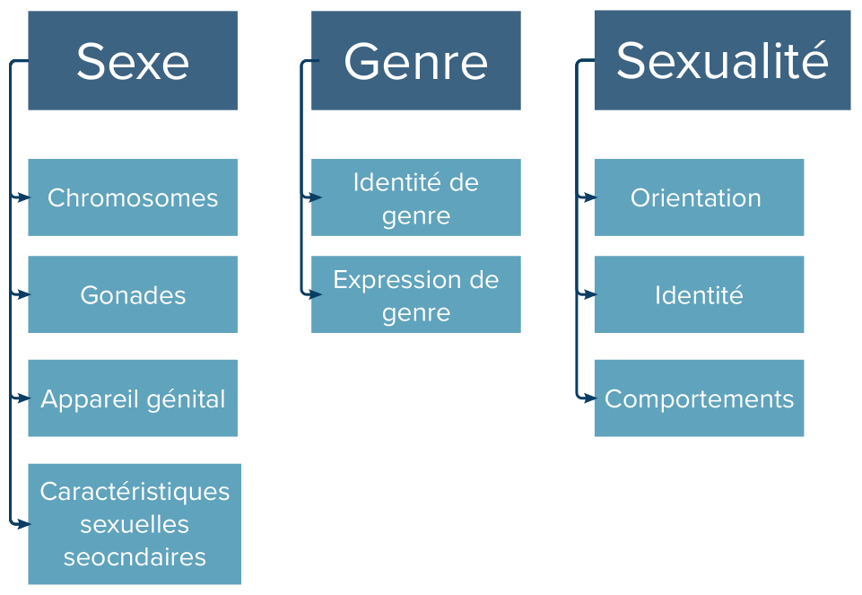

```{r ref, include=FALSE}
requireNamespace('citr')
citr::tidy_bib_file(
  rmd_file = c('02-introduction.Rmd', '03-methodology.Rmd', '05-discussion.Rmd', '08-appendix.Rmd'),
  messy_bibliography = 'files/TFE.bib',
  file = 'references.bib'
)
```

# (PART) Texte principal {.unnumbered}

# Introduction

## Notions préalables

### Sexes, genres et sexualités

Trois concepts doivent être distingués pour comprendre les transidentités : les sexes, les genres, et les orientations sexuelles [@americanpsychologicalassociation2014]. La figure \@ref(fig:SGS) représente visuellement cette distinction.

Les sexes correspondent aux caractéristiques biologiques d'un individu et sont généralement assignés à la naissance, voire avant. Différemment aux conceptions classiques, il ne s'agit pas d'une entité binaire, composée exclusivement des deux pôles "mâle" et "femelle". En effet, l'avancée des connaissances en biologie a permis d'avoir une vision plus nuancée des sexes en tant que spectre se divisant en quatre axes [@Ainsworth2015] :

1.  Les chromosomes ;

2.  Les gonades ;

3.  L'appareil génital ;

4.  Les caractéristiques sexuelles secondaires (taux hormonaux, pilosité, voix, etc.)

Pour la majorité des individus, ces quatre caractéristiques s'alignent et se situent à l'un des extrêmes du spectre (p. ex. un individu XY avec des testicules, un pénis, et des caractéristiques sexuelles secondaires masculines) ; on parle alors de personnes dyadiques. Néanmoins, des variations plus ou moins subtiles sont fréquentes et l'on estime que jusqu'à 1.7% de la population est concerné·e par de telles variations [@VanLisdonk2014]. On parle d'intersexuation pour se référer à ces variations du développement sexuel et de personnes intersexes pour évoquer les personnes concernées.

Les genres, quant à eux, peut être sous-divisés en deux :

1.  L'identité de genre, qui correspond au sentiment d'être un homme, une femme, ou de se situer en dehors de cette binarité ;

2.  L'expression de genre, qui correspond à la manière dont les individus vont exprimer leur identité de genre en société, par l'habillement, le maquillage, etc.

Enfin, au niveau des sexualités, il est intéressant de séparer les orientations sexuelles, qui correspondent aux personnes par lesquelles on peut être attiré·e, l'identité, qui correspond à la manière de définir sa sexualité (gay, bisexuel·le, asexuel·le, etc.) et les comportements sexuels que l'on a réellement en pratique.

Ces trois concepts, s'ils peuvent être interconnectés, n'en demeurent pas moins indépendants. En pratique, une personne transgenre peut donc très bien être intersexe et avoir n'importe quelle orientation sexuelle. On ne peut pas présupposer de l'orientation sexuelle d'une personne en fonction de sa transidentité.

```{r SGS_word, echo=FALSE, warning=FALSE, message=FALSE, fig.id = "SGS", fig.cap= 'Représentation schématique de la distinction sexe, genre, et sexualité', fig.width=5.5, fig.height=3.8, eval = !knitr::is_html_output()}


```

```{r SGS, fig.align='center', fig.cap= 'Représentation schématique de la distinction sexe, genre, et sexualité', echo=FALSE, out.width = '95%', eval = knitr::is_html_output()}

knitr::include_graphics('files/sexe_genre_sexualite.png', dpi = 300)
```

### Les transidentités

Les personnes transgenres sont donc des personnes dont le genre ne correspond pas avec le sexe qui leur a été assigné à la naissance [@americanpsychologicalassociation2014]. Il s'agit d'un terme-parapluie regroupant une grande diversité d'identités et d'expression de genre différentes. Ainsi retrouve-t-on, en plus des hommes et des femmes transgenres, une multitude d'identités dites non-binaires. Les personnes non-binaires ne se retrouvent pas - ou, du moins, pas entièrement- dans les genres 'hommes' et 'femmes'. Certaines personnes non-binaires se définissent en-dehors du masculin et du féminin, d'autres oscillent quelque part entre les deux sans s'identifier complètement à l'un de ces deux genres. En outre, l'identification peut être fluide et varier en fonction du temps [@americanpsychologicalassociation2014].

En raison de cette pluralité d'expérience et de parcours, il est malaisé d'estimer le nombre de personnes transgenres. De fait, l'estimation varie en fonction que l'on prenne en compte l'auto-identification en tant que personne transgenre ou différentes étapes de transition sociale, administrative, hormonale ou chirurgicale. J'ai choisi de retenir l'auto-identification comme critère en raison de l'approche trans-affirmative de ce travail. Par ailleurs, sachant que les parcours de transition sont variés, se limiter à une étape (p. ex. le fait d'être sous traitement hormonal) relève d'une décision arbitraire qui sous-estimera les estimations. Un rapport de 2016 estime que 0.6% de la population adulte américaine est transgenre en se basant sur l'autodétermination des individus [@flores2016], mais des estimations récentes grimpent jusqu'à 2% [@goodman2019]. Sachant que le rapport d'activité de 2013 de l'INAMI indiquait un nombre médian de 842 patient·e·s par généraliste [@commissiondeprofilsdesmedecinsgeneralistes2015], chaque généraliste devrait avoir une médiane 5 à 17 patient·e·s transgenres dans sa patientèle.

### Nécessité déontologique de se former dans les thématiques trans-spécifiques

Même si cette estimation est simpliste, elle a le mérite d'indiquer un fait important : nous devrions tou·te·s avoir des patient·e·s transgenres en consultation. Leur assurer une prise en charge de qualité est donc un impératif déontologique. C'est ce qu'a rappelé l'Ordre des Médecins dans sa séance du 16 octobre 2021 : *"[...] Le Conseil national recommande aux universités et aux médecins de développer et de maintenir leurs connaissances en tenant compte de la diversité des identités de genre et des orientations sexuelles. Le questionnement sur l'identité de genre ou sur la sexualité, notamment chez l'adolescent, le malaise identitaire, le stress et la souffrance psychique liés à la dissimulation sont des questions de santé qui doivent davantage retenir l'attention des médecins, notamment de première ligne."* [@ordredesmedecins2021]

Le reste de cette introduction propose donc un rapide survol des spécificités de santé chez les personnes transgenres, en commençant par un résumé des inégalités de santé qui les touchent en matière de prévalence et d'accès au soin. La section suivante décrit les bases du traitement hormonal d'affirmation de genre (THAG). L'objectif de cette introduction est de donner les clés nécessaires pour mieux comprendre les résultats ainsi que les enjeux soulevés dans la discussion. Si la question du THAG est juste survolée dans l'introduction, les annexes proposent en revanche un guide pratique à destination des médecins généralistes. Ce guide a été réalisé à partir de la synthèse des articles scientifiques que j'ai dû consulter pour ma propre activité clinique.

## La santé des personnes transgenres

### Disparités de santé

#### Prévalence

Une des disparités de santé les plus étayées dans la littérature scientifique est la prévalence plus élevée de dépression. En effet, des chiffres de 53-55 % sont avancés dans les études internationales [@McNeil2012; @witcomb2018]. En outre, les tentatives de suicide sont également plus fréquentes. Une revue systématique de la littérature publiée en 2016 a mis en évidence des estimations allant de 32% à 52,4% d'antécédents de tentative de suicide chez les personnes transgenres [@Marshall2016]. Les comportements automutilatoires étaient également plus fréquents dans cette étude. En Belgique, 33,5% des répondant·e·s de l'enquête de l'Institut pour l'Égalité des Femmes et des Hommes (IEFH) avaient déjà fait une tentative de suicide, contre une moyenne belge de 4,2% [@motmans2017].

Ces disparités en santé mentale se développent dans un contexte de surexposition à la violence, commençant dès l'enfance et se poursuivant durant la vie adulte. De fait, les enfants transgenres sont exposés à trois fois plus de violences que les enfants cisgenres, notamment à l'école et au sein du milieu familial [@wirtz2020]. De plus, à l'âge adulte, les personnes transgenres sont exposées à deux à trois fois plus de violences entre partenaires que les personnes cisgenres [@peitzmeier2020]. Enfin, 47% des personnes transgenres ont déjà été agressées sexuellement, ce chiffre grimpant jusqu'à 55% pour les personnes non-binaires [@james2016].

Sur le plan de la santé sexuelle, une prévalence plus élevée pour le VIH, la gonorrhée, et la chlamydia ont été identifiées dans la littérature internationale [@Pitasi2019; @becasen2019].

#### Stress minoritaire

L'origine de ces chiffres peut être expliquée par la théorie du stress minoritaire. Conceptualisé par Meyer en 2003, ce modèle postule que les personnes issues d'une minorité sexuelle sont exposées à un surcroît de stress par leur statut de minorité [@meyer2003]. Meyer distingue à cet effet deux facteurs de stress : les facteurs distaux et les facteurs proximaux. Les facteurs distaux, extérieurs à l'individu et objectifs, correspondent aux expériences de discrimination, de rejet et de violence. Les facteurs de stress proximaux, quant à eux, sont subjectifs et internes. Il s'agit de l'anticipation d'évènements négatifs, de la dissimulation de son orientation sexuelle ainsi que de l'homophobie internalisée, c'est-à-dire l'intériorisation d'idées négatives concernant son orientation sexuelle, pouvant aller jusqu'au rejet complet. Ce modèle a ensuite été étendu aux personnes transgenres en 2015 par Testa et Bockting [@testa2015]. Gardant le modèle originel presque inchangé, il rajoute la notion de non-affirmation du genre comme facteur de stress distal. Le fait de mégenrer une personne transgenre, c'est-à-dire d'employer les pronoms de son sexe assigné plutôt que de son genre, ou de la morinommer, c'est-à-dire d'utiliser le prénom de naissance, sont deux exemples de non-affirmation du genre. Du côté des facteurs de stress distaux, on retrouve la transphobie internalisée et la dissimulation de sa transidentité, en plus de l'anticipation d'évènements négatifs. Une méta-analyse publiée en 2022 et conduite sur 85 articles a trouvé des associations significatives entre l'expérience de facteurs de stress minoritaire avec la dépression et les tentatives de suicide [@pellicane2022]. Ces résultats appuient la nécessité d'établir un cadre trans-affirmatif, c'est-à-dire non-pathologisant et respectant l'autodétermination et l'expertise des personnes transgenres.

### Accès au soin

L'accès au soin est un enjeu majeur pour les personnes transgenres. La relation avec le monde médical est rendue compliquée par le manque de formation des professionnel·le·s, à la fois dans les compétences médicales, mais également dans les compétences culturelles [@pampati2021]. Ce manque de compétences culturelles se traduit en pratique par un non-respect des pronoms et du prénom, ainsi que par des questions et examens cliniques invasifs, même lorsque la consultation n'avait aucun lien avec la transidentité [@teti2021; @hostetter2022]. Cela recouvre par exemple des questions sur les opérations chirurgicales éventuelles ou sur les organes génitaux des patient·e·s. De plus, sur le plan des compétences médicales, le manque de formation se traduit par un manque de dépistage d'IST ou de cancer [@teti2021]. En outre, le manque de professionnel·le·s formé·e·s entraîne une limitation de l'accès aux soins d'affirmation de genre pour les personnes qui en ont besoin [@hostetter2022]. En Belgique, 24,7% des répondant·e·s de l'enquête de l'IEFH n'avaient pas cherché d'aide médicale pour leur transition, notamment pour des raisons de peur de préjugés de la part des professionnel·le·s (24,2% des personnes n'ayant pas cherché d'aide médicale) ou faute de savoir où s'adresser (21,2%) [@motmans2017]. Et, parmi les personnes s'étant adressé·e·s à leur médecin traitant, seul·e·s 56.8% ont reçu des informations jugées utiles et pertinentes. Ces différents éléments ont pour conséquence d'entraîner un moindre recours au soin, même lorsqu'il est nécessaire, ce qui exacerbe les inégalités de santé susmentionnées [@hostetter2022].

## Le traitement hormonal d'affirmation de genre

### Objectif du traitement

L'objectif du THAG est d'améliorer le bien-être de la personne en la rapprochant de son point de confort corporel. Les études montrent, effectivement, que le bien-être psychologique global augmente après THAG, tandis que la dépression et les idées suicidaires diminuent [@green2021]. Pour ce faire, le concept de point de confort, bien développé par Genres Pluriels, est important à garder à l'esprit. Il s'agit de *"l'ensemble des caractéristiques mentales, comportementales, vestimentaires ou corporelles qui favorisent le sentiment de bien-être par rapport à son identité de genre"* [@genrespluriels2018]. Il est important de reconnaitre que ce point de confort est variable d'une personne à l'autre et qu'il n'existe pas un seul parcours de transition type. À ce titre, il doit être recherché à l'anamnèse et rediscuté tout au long du suivi, dans la mesure où il peut varier avec le temps. Toutes les personnes transgenres ne choisissent pas d'entamer un THAG. Cependant, il s'agit d'un besoin fréquent, qui concernait 81.9% des personnes transmasculines et 89.4% des personnes transféminines ayant répondu à l'enquête de l'IEFH [@motmans2017].

### Deux modèles d'initiation du traitement

Il existe deux modèles principaux concernant l'initiation du traitement : le modèle standard promu par la *World Professional Association for Transgender Health* (WPATH) et l'*Endocrine Society*, qui requiert une évaluation psychiatrique et un diagnostic de "dysphorie de genre" et le modèle du consentement éclairé [@clark2021]. En Belgique, le premier modèle est celui des deux équipes de genre de Liège et de Gand. Cette nécessité d'un diagnostic pour accéder au THAG rentre en contradiction avec les principes de Jogjakarta, dont la Belgique est signataire, ainsi qu'avec le rapport du Parlement européen, tous deux mettant en avant l'importance de l'autodétermination comme droit humain fondamental [@terricabras2018; @2007]. Dans le cadre d'une approche trans-affirmative, le modèle du consentement éclairé reconnait aux individus la capacité de déterminer leur identité ainsi que de choisir les soins qui leur semblent appropriés [@clark2021]. Dans ce contexte, le rôle des médecins est d'informer au mieux les patient·e·s sur les conséquences positives et négatives du THAG afin d'obtenir un consentement libre et éclairé, point de départ du THAG. Le Réseau psycho-médico-social trans\*/inter\* belge, mis en place par Genres Pluriels, appartient à ce second modèle. Il permet un suivi pluridisciplinaire au départ d'une première ligne psychosociale informative avant une orientation médicale, et accompagne les personnes durant tout leur suivi.

### Traitement féminisant

#### Effets

Les effets du THAG chez les femmes transgenres consistent en des modifications de la fonction sexuelle et de la composition corporelle, un adoucissement de la peau, un développement mammaire, une diminution de la pilosité, et un arrêt de l'alopécie androgénique [@hembree2017]. La diminution de la pilosité est d'apparition lente et d'efficacité modérée, rendant le recours à l'épilation définitive fréquent, lorsque cet élément est important pour le point de confort. Les modifications de la fonction sexuelle consistent en une diminution des érections spontanées, une diminution du volume testiculaire et un impact partiellement réversible sur la spermatogenèse, pouvant aller jusqu'à l'azoospermie complète [@randolph2018]. Il est donc important d'informer les patientes des conséquences sur leur fertilité, et de leur recommander une cryopréservation des gamètes avant initiation, en cas de désir de parentalité. En Belgique, seul·e·s 30,5% des répondant·e·s de l'enquête de l'IEFH avaient reçu ces informations avant initiation du THAG [@motmans2017]. Les modifications de la composition corporelle correspondent à une répartition plus féminine des graisses ainsi qu'à une diminution de la musculature.

Une partie de ces effets dépendent uniquement de la concentration sérique en œstradiol (E2~s~) tandis que d'autres dépendent uniquement de la diminution de la concentration sérique en testostérone (T~s~). Ainsi la modification des fonctions sexuelles, la diminution de la pilosité, la diminution de la musculature, et l'arrêt de l'alopécie androgénique dépendent-ils tous de la T~s~ [@randolph2018]. A contrario, le développement mammaire, la répartition féminine des graisses, et l'adoucissement de la peau dépendent de l'E2~s~ [@randolph2018]. Connaître le point de confort des patientes permet donc de définir des objectifs plus individualisés, notamment vis-à-vis des valeurs à atteindre à la prise de sang et des traitements à employer pour ce faire.

#### Modalités

La base du THAG est l'œstradiol [@TSjoen2019]. Celui-ci permet en effet de d'augmenter l'E2~s~ tout en diminuant la T~s~ via son action inhibitrice sur l'axe hypothalamo-hypophyso-gonadique (HHG). Les formes transdermiques d'œstradiol sont à privilégier, en raison d'un risque thrombotique moindre [@scheres2021]. En Belgique, les options possibles sont l'Oestrogel et le Lenzetto, en gel, et le Dermestril en patch. L'objectif défini par les guidelines est d'obtenir les valeurs hormonales de femmes cisgenres, soit un E2~s~ entre 100 et 200ng/L et une T~s~ inférieure à 1.76nmol/L [@hembree2017; @TSjoen2019]. Ces valeurs restent néanmoins arbitraires et les études manquent pour évaluer leur efficacité sur des outcomes cliniques pertinents tels que le bien-être des patientes [@haupt2020].

Ce manque de recherche est particulièrement manifeste vis-à-vis des antiandrogènes, pour lesquels les pratiques varient d'un pays à l'autre et sur lesquels il n'existe pas de consensus scientifique vis-à-vis du traitement à privilégier [@angus2021]. Un des traitements les plus fréquemment prescrits dans ce contexte est la Spironolactone, qui agit comme inhibiteur partiel de la synthèse de testostérone, antagoniste faible des récepteurs androgéniques, agoniste faible des récepteurs de la progestérone et agoniste faible des récepteurs œstrogéniques [@angus2021]. Puisque son action principale ne passe pas par une diminution de la T~s~, les valeurs de laboratoire représentent un marqueur imparfait de son efficacité [@angus2021]. Une autre possibilité réside dans l'usage d'analogues de la GnRH pour leur action inhibitrice puissante de l'axe HHG [@angus2021]. Malheureusement, en Belgique, ces traitements ne sont pas remboursés dans ce contexte et leur prix est une barrière conséquente. Le Depo-Eligard, est un exemple de ce genre de molécule et s'administre par injections sous-cutanées mensuelles, trimestrielles ou bisannuelles. Enfin, l'acétate de cyprotérone, vendu sous le nom d'Androcur en Belgique, est tombé en désuétude ces dernières années. En effet, cette molécule a été associée, entre autres, à un risque accru de méningiome et d'hépatotoxicité [@angus2021]. D'autres molécules sont également employées comme le Finastéride ou le Bicalutamide, mais elles sont encore moins étudiées que les autres et exposent à des risques d'hépatotoxicité [@angus2021].

Enfin, de la progestérone est parfois prescrite aux femmes transgenres en vue d'améliorer le développement mammaire et la forme de la poitrine. Néanmoins, il n'existe actuellement pas de données scientifiques montrant ou infirmant un effet de cette molécule sur la poitrine des femmes transgenres [@iwamoto2019; @iwamoto2019a]. De surcroît, la progestérone pourrait interférer avec le développement mammaire si elle est administrée trop tôt [@iwamoto2019].

En pratique, la médecine basée sur les preuves se fonde à la fois sur l'expérience clinique, les données scientifiques et les préférences des patient·e·s [@sackett1996]. De ce fait, vu que les données scientifiques manquent sur le choix d'un antiandrogène ou l'utilité de la progestérone, les préférences des patientes devraient avoir d'autant plus de place dans la décision clinique partagée, après explications des risques et bénéfices de chaque molécule.

#### Sécurité

Les deux éléments les plus importants à prendre en compte dans la sécurité de ces traitements sont le risque accru de thrombose et l'augmentation des cancers mammaires sous œstradiol [@TSjoen2019; @hembree2017; @iwamoto2019] . Toutefois, même si une augmentation des risques relatifs est bien étayée, les risques absolus demeurent relativement faibles. Ainsi une étude sur 2260 femmes transgenres n'a-t-elle retrouvé que 18 cancers mammaires après une durée médiane de 18 ans de THAG [@deblok2019a]. Si l'incidence était 46.7x supérieure à celle chez les hommes cisgenres, vu la rareté des cancers mammaires dans cette population, elle restait trois fois inférieure à celle des femmes cisgenres. De la même manière, si le risque de thrombose veineuse profonde (TVP) augmente bel et bien après THAG, une récente méta-analyse a montré un taux d'incidence poolé de 11,2 TVP par 10 000 femmes transgenres par an, par voie transdermique [@kotamarti2021]. Ce chiffre grimpait à 34 pour les formes orales. Des doutes existent toujours sur les risques d'infarctus du myocarde et d'AVC ischémique sous THAG féminisant, mais les dernières données suggèrent un risque accru par rapport aux femmes cisgenres pour les infarctus et par rapport aux hommes et femmes cisgenres pour les AVC ischémiques [@connelly2019].

### Traitement masculinisant

#### Effets

Les effets du THAG masculinisant sont l'aménorrhée, le développement du clitoris, l'acné, l'aggravation de la voix, une majoration de la pilosité, une redistribution masculine des graisses, une majoration de la musculature, et une alopécie androgénique [@moravek2018]. Le terme employé dans la communauté pour parler de cette augmentation de taille du clitoris est "*dickclit"*. Les effets sur la voix et le dickclit sont irréversibles [@moravek2018]. Il n'y a pas de donnée claire sur la réversibilité de l'alopécie androgénique et de la majoration de la pilosité, mais un arrêt de l'alopécie et une réversibilité partielle de la pilosité paraissent vraisemblables. L'impact sur la fertilité semble moins sévère que pour le THAG féminisant [@yaish2021], mais un counseling adéquat reste de mise. Il est important de noter que les hommes transgenres peuvent toujours tomber enceints sous THAG, y compris en l'absence de règles [@taub2020]. Une contraception adéquate doit donc être proposée pour les patients dont les rapports sexuels peuvent induire une grossesse [@krempasky2020].

#### Modalités

Le THAG masculinisant est relativement plus simple que le féminisant, car il ne comporte qu'une molécule, la testostérone, et qu'il n'y a pas de controverse majeure sur le choix du traitement [@TSjoen2019]. En Belgique, les options disponibles sont le Sustanon, le Nebido, l'Androgel, et le Testarzon. Le premier est injecté toutes les 2 à 4 semaines, le deuxième, toutes les 10 à 14 semaines, et les deux derniers sont des gels à appliquer quotidiennement [@hembree2017]. À noter que le gel semble moins efficace que les deux autres produits pour induire une aménorrhée, sans doute en lien avec une T2~s~ généralement plus faible [@carswell2017].

En cas de traitement par injection, la prise de sang de contrôle devra être réalisée à des moments spécifiques pour que les valeurs soient interprétables. Pour le Sustanon, on peut soit réaliser la prise de sang à mi-chemin entre deux injections soit juste avant l'injection suivante [@hembree2017]. Pour le Nebido, il est nécessaire de réaliser la prise de sang juste avant l'injection [@hembree2017]. Dans les deux cas, les valeurs cibles dans les guidelines sont de 14-24nmol/L [@hembree2017].

#### Sécurité

Le THAG masculinisant semble sûr. En effet, on ne retrouve pas de surplus d'évènements cardiovasculaire, malgré l'instauration d'un profil métabolique athérogène se caractérisant par une diminution du HDL-cholestérol (HDL-C) et une majoration des triglycérides [@TSjoen2019; @irwig2017; @hembree2017]. L'hématocrite augmente sous THAG masculinisant, mais rarement de manière significative [@TSjoen2019]. Enfin, et il s'agit d'un point important à souligner, il n'y a aucune preuve en faveur d'une majoration du risque de cancer de l'endomètre ou des ovaires sous THAG masculinisant [@TSjoen2019; @hembree2017; @moravek2018; @deblok2019]. Il n'y a pas non plus d'arguments en faveur d'une augmentation des cancers du sein sous THAG masculinisant [@moravek2018]. À ce titre, l'étude de cohorte susmentionnée avait mis en évidence quatre cancers du sein sur 1229 hommes transgenres après une médiane de 15 ans après initiation du THAG [@deblok2019a], soit 1/5 de l'incidence attendue pour les femmes cisgenres, mais 58,9x supérieure à celle attendue pour les hommes cisgenres. Sachant que trois de ces cancers étaient apparus après torsoplastie, une surveillance clinique reste indiquée, même après cette opération.

## Objectif du TFE

Comme développé durant cette introduction, le contexte de discriminations et de violences auquel les personnes transgenres sont exposées entraîne une prévalence plus élevée de problèmes de santé. Or, face à cela, iels doivent souvent composer avec un monde médical manquant de la formation nécessaire pour les aider et qui risque sans le vouloir de reproduire des violences en consultation. À cela se rajoutent des barrières inutiles pour accéder à des traitements qui pourraient améliorer leur bien-être global.

Je suis convaincu qu'une partie de la solution réside dans le renforcement des capacités de la première ligne à offrir des soins de qualité dans un cadre trans-affirmatif. Par conséquent, l'objectif de ce TFE est de présenter un retour d'expérience ainsi que des recommandations établies à partir de la littérature scientifique et de la compétence que j'ai acquise dans ce domaine. J'espère, ce faisant, que davantage de médecins généralistes se sentent mieux équipés pour suivre des patient·e·s transgenres et contribuent ainsi à les lier au soin.

\newpage
