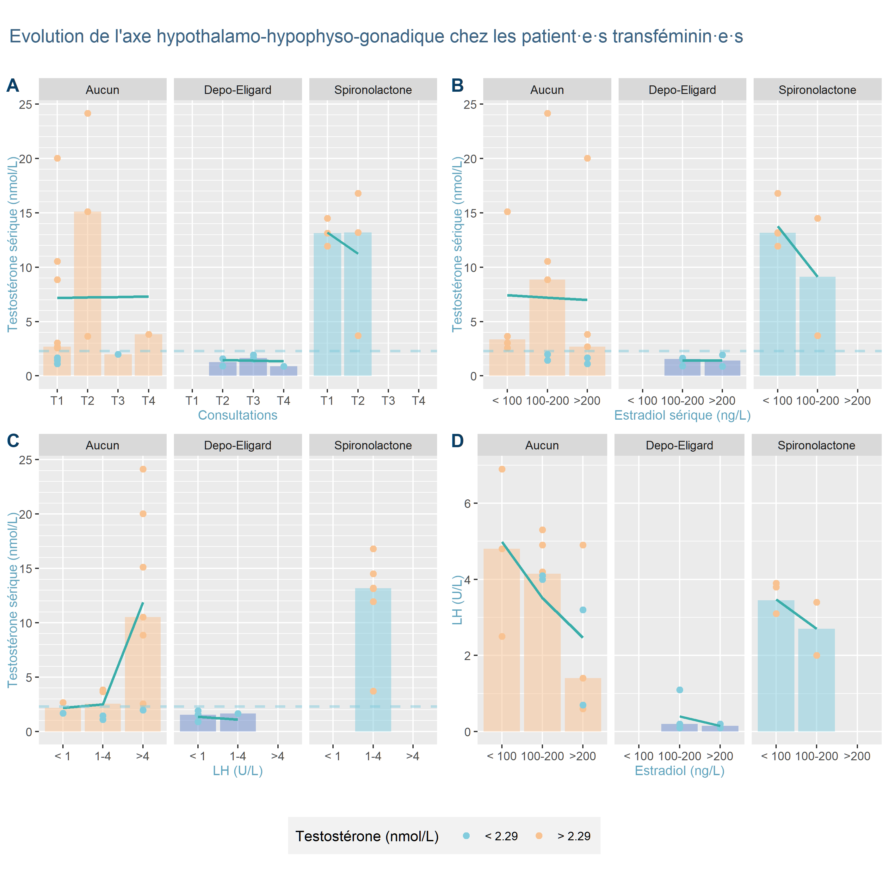

# Résultats

```{r import_data, message=FALSE, warning=FALSE, include=FALSE}

source('scripts/import_data.R')
source('scripts/data_manipulation/inline.R', encoding = 'UTF-8')
requireNamespace('scales')
```

## Participant·e·s

### Éligibilité

Parmi les 71 patient·e·s que j'ai déjà vu·e·s au moins une fois en consultation dans le but d'initier ou de suivre un THAG, 24 avaient déjà un traitement en place, instauré par une autre personne que moi. À noter que 3 patient·e·s avaient commencé leur traitement sans supervision médicale. En outre, 10 patient·e·s n'avaient pas encore entamé leur THAG au moment où s'est achevée l'étape de sélection des participant·e·s. Enfin, 10 patient·e·s avaient entamé un THAG depuis moins de trois mois et n'avaient donc pas encore bénéficié d'une consultation à T1. 26 des 27 patient·e·s éligibles ont répondu positivement pour que leurs données soient utilisées dans le cadre de ce TFE. La figure \@ref(fig:flowchart) donne une représentation graphique de ce processus de sélection.

```{r flowchart_word, echo=FALSE, warning=FALSE, message=FALSE, fig.id = "flowchart", fig.cap= 'Diagramme de flux présentant la sélection des patient·e·s pour le TFE', fig.width=5.56, fig.height=5, eval = !knitr::is_html_output()}

knitr::include_graphics('files/sample_flowchart.png')
```

```{r flowchart, fig.align='center', fig.cap= 'Diagramme de flux présentant la sélection des patient·e·s pour le TFE', echo=FALSE, out.width = '95%', eval = knitr::is_html_output()}

knitr::include_graphics('files/sample_flowchart.png', dpi = 300)
```

### Caractéristiques démographiques

Les participant·e·s étaient âgé·e·s de `r min(obj_demog_data$age)` à `r max(obj_demog_data$age)` ans (âge médian : `r round(median(obj_demog_data$age))` ans) et se répartissaient en `r sum(obj_demog_data$genre == "F")` femmes transgenres, `r sum(obj_demog_data$genre == "M")` hommes transgenres, `r sum(obj_demog_data$genre == "NB" & obj_demog_data$sexe == 'F')` personnes non-binaires transmasculines, et `r sum(obj_demog_data$genre == "NB" & obj_demog_data$sexe == 'M')` personne non-binaire transféminine. `r scales::percent(sum(obj_demog_data$province == 'Liege')/nrow(obj_demog_data))` des participant·e·s vivaient dans la province de Liège. `r sum(obj_demog_data$mutuelle == 'BIM')` participant·e·s étaient BIM et `r sum(obj_demog_data$mutuelle == "Non-inscrit")` n'étaient pas en ordre de mutuelle. `r scales::percent((sum(obj_demog_data$adm_pren == '1')+sum(obj_demog_data$adm_pren == '2'))/nrow(obj_demog_data))` des participant·e·s avaient modifié leur prénom et `r scales::percent((sum(obj_demog_data$adm_cec == '1')+sum(obj_demog_data$adm_cec == '2'))/nrow(obj_demog_data))` avaient modifié leur marqueur de genre à l'état-civil . Toutes ces caractéristiques démographiques sont résumées dans le tableau \@ref(tab:DemogTab).

<center>

<caption>

(#tab:DemogTab) Caractéristiques démographiques des participant·e·s

</caption>

</center>

```{r demog_table, include=FALSE}

source('scripts/tables/demog_table.R', encoding = 'UTF-8')
```

```{r DemogTab, echo=FALSE, warning=FALSE, message=FALSE, tab.id = "DemogTab", out.width = '100%', eval = knitr::is_html_output()}

.demog_tbl_HTML
```

```{r demog_table_word, echo=FALSE, warning=FALSE, message=FALSE, tab.id = "DemogTab", eval = !knitr::is_html_output()}
.demog_ft_word
```

Pour le reste de ce TFE, les hommes transgenres et personnes non-binaires transmasculines ont été fusionnées dans la catégorie "patient·e·s transmasculin·e·s" tandis que les femmes transgenres et les personnes non-binaires transféminines ont été réunies dans la catégorie "patient·e·s transféminin·e·s" afin d'obtenir suffisamment de cas dans chaque case.

### Problèmes de santé

```{r ant_data_manipulation, include=FALSE}
source('scripts/data_manipulation/ant_data_manipulation.R', encoding = 'UTF-8')
```

Les problèmes de santé les plus représentés dans l'échantillon étaient des problèmes de santé mentale, avec `r .N_dep` patient·e·s présentant un trouble dépressif majeur (soit `r .p_dep` de l'échantillon), `r .N_anx` patient présentant un trouble anxieux et `r .N_alc` patient·e présentant un mésusage d'alcool. Les autres problèmes de santé retrouvés dans l'échantillon n'étaient présents qu'une fois : anémie ferriprive, asthme, BPCO, eczéma, syndrome de Fanconi, syndrome des ovaires micropolykystiques, rhinite chronique, et thrombophilie. En outre, `r .N_TSA_F` patient·e·s se situaient sur le spectre autistique.

### Durée du suivi

```{r followup, include = FALSE}
source('scripts/data_manipulation/create_long_data.R', encoding = 'UTF-8')
source('scripts/plots/create_follow_up_plot.R', encoding = 'UTF-8')
```

Les participants·e·s de l'étude ont été suivis entre `r min(.followup_time$followup)` et `r max(.followup_time$followup)` jours avec une durée médiane de `r round(median(.followup_time$followup))` jours. `r sum(.followup$N[.followup$time_classe == '3 mois'])` patient·e·s ont été suivi·e·s durant trois mois, `r sum(.followup$N[.followup$time_classe == '6 mois'])` patient·e·s, durant six mois `r sum(.followup$N[.followup$time_classe == '9 mois'])`, durant neuf mois, et `r sum(.followup$N[.followup$time_classe == '12 mois'])`, durant douze mois ou plus. Un·e seul·e patient·e a été perdu·e de vue, à la suite de sa décision d'interrompre le THAG. La figure \@ref(fig:FollowPlot) représente la durée du suivi, par genres.

```{r FollowPlot, echo=FALSE, warning=FALSE, message=FALSE, fig.align='center', fig.cap="Durée du suivi, par genres", fig.dim=c(10,8), out.width = '100%', out.height='400px', eval = knitr::is_html_output()}

.anim_followup_plot
```

```{r followup_plot_word, echo=FALSE, warning=FALSE, message=FALSE, fig.id = "FollowPlot", fig.cap="Nombre de patient·e·s par consultation trimestrielle et par genres", fig.width=6.7, fig.height=4, eval = !knitr::is_html_output()}

knitr::include_graphics('output/plots/followup_plot.png')
```

## Synthèse des anamnèses

### Contexte social

```{r fam_plot, include=FALSE}
source('scripts/plots/create_fam_plot.R', encoding = 'UTF-8')
source('scripts/plots/create_amis_plot.R', encoding = 'UTF-8')
```

Une des questions que je pose à l'anamnèse de la première consultation est de savoir si un *coming out* a été fait et, si oui, auprès de quelles personnes et avec quelles réactions. L'objectif de cette question est d'évaluer le degré de soutien social dans le processus de transition. La figure \@ref(fig:FamPlot) montre une représentation graphique du coming out familial des patient·e·s de l'échantillon. Les patient·s· transmasculin·e·s de l'échantillon avaient tous au moins fait leur coming out à leurs deux parents tandis que `r .N_transfem_conceal` patient·e·s transféminin·e·s sur `r .N_transfem` n'avaient fait leur coming out qu'à une partie de leur famille, voire à personne pour l'une d'entre elles. À noter que l'information était absente du dossier pour `r sum(is.na(subj_soc_data$fam_pers))` patient·e·s transmasculin·e·s.

Parmi les patient·e·s ayant fait un coming out à leur famille, `r .p_reac_diff` ont vécu quelques difficultés dans les relations familiales par la suite dont `r .p_reac_neg` qui ont dû faire face à une réaction négative voire hostile.

```{r FamPlot, echo=FALSE, warning=FALSE, message=FALSE, fig.align='center', fig.cap="Membres de la famille auxquel·le·s les participant·e·s ont annoncé leur transidentité, par genres", out.width = '100%', out.height='500px', eval = knitr::is_html_output()}

.anim_fam_plot
```

```{r fam_plot_word, echo=FALSE, warning=FALSE, message=FALSE, fig.id = "FamPlot", fig.cap="Membres de la famille auxquel·le·s les participant·e·s ont annoncé leur transidentité, par genres", fig.width=6.7, fig.height=4, eval = !knitr::is_html_output()}

knitr::include_graphics('output/plots/fam_plot.png')
```

Sur le plan amical, la figure \@ref(fig:AmisPlot) montre un schéma similaire à ce qui a été décrit pour le *coming out* familial avec une moins grande tendance des personnes transféminines à révéler leur transidentité à leurs proches. Ces résultats doivent toutefois être interprétés prudemment dans la mesure où il manque des données pour 9 participant·e·s (5 personnes transféminines et 4 personnes transmasculines). Toutefois, puisque les valeurs manquantes ne touchaient pas disproportionnellement un groupe et que les résultats étaient cohérents avec ceux de la figure \@ref(fig:FamPlot), j'ai choisi de présenter ce graphique. En ce qui concerne la réaction des ami·e·s, celle-ci a été positive pour la totalité de l'échantillon.

```{r AmisPlot, echo=FALSE, warning=FALSE, message=FALSE, fig.align='center', fig.cap="Ami·e·s auxquel·le·s les participant·e·s ont annoncé leur transidentité, par genres", out.width = '100%', out.height='500px', eval = knitr::is_html_output()}

.anim_amis_plot
```

```{r amis_plot_word, echo=FALSE, warning=FALSE, message=FALSE, fig.id = "AmisPlot", fig.cap="Ami·e·s auxquel·le·s les participant·e·s ont annoncé leur transidentité, par genres", fig.width=6.7, fig.height=4, eval = !knitr::is_html_output()}

knitr::include_graphics('output/plots/amis_plot.png')
```

### Attentes vis-à-vis du THAG

Afin de mieux cerner les attentes des patient·e·s et de leur proposer un traitement le plus adapté à ces dernières, je leur demande ensuite s'iels connaissent les effets du THAG et, si oui, s'iels identifient des effets particulièrement importants pour leur point de confort actuel.

Pour les personnes transféminines, les effets les plus souvent mentionnés comme prioritaires étaient : une majoration de la poitrine (`r .p_prio_poit` des patient·e·s), une répartition plus féminine des graisses (`r .p_prio_gras_F`), une diminution de la pilosité (`r .p_prio_pilo_F`), et un arrêt de la progression de l'alopécie androgénique (`r .p_prio_alo`). Un·e patient·e avait mentionné l'adoucissement de la peau tandis qu'aucun·e patient·e n'avait explicitement évoqué la diminution des érections spontanées ou la diminution de la masse musculaire comme étant une priorité.

Pour les personnes transmasculines, l'aggravation de la voix était l'effet le plus souvent recherché. Il s'agissait d'une priorité pour `r .p_prio_voix` des patient·e·s et du seul effet attendu pour `r .N_voix_seul`. Une répartition plus masculine des graisses et une majoration de la musculature étaient une priorité pour `r .p_prio_gras_M` des patient·e·s. `r .p_prio_pilo_M` des patient·e·s considéraient la majoration de leur pilosité comme une priorité tandis qu'un·e des patient·e·s avait mentionné l'accroissement du dickclit. Aucun·e n'avait cité l'aménorrhée comme étant sa priorité à l'initiation du THAG.

Au niveau des inquiétudes vis-à-vis de l'instauration du THAG, deux patient·e·s ont mentionné l'alopécie, un·e patient·e a évoqué l'acné, et un·e patient·e avait peur d'avoir une humeur plus instable à l'instauration du traitement.

Vu les impacts du THAG sur la fertilité mentionnés dans l'introduction, je demande aux patient·e·s s'iels sont intéressé·e·s par la cryopréservation de leurs gamètes avant d'instaurer le THAG. Aucun patient transmasculin de l'échantillon n'a choisi de congeler ses gamètes avant THAG tandis que `r sum(subj_horm_data$cryo == '1')` patient·e·s transféminin·e·s ont préféré entamer les démarches de cryopréservation avant de commencer le THAG.

### Besoins chirurgicaux

```{r chir_data, include=FALSE}
source('scripts/data_manipulation/manipulate_subj_chir_data.R', encoding = 'UTF-8')
```

Toujours dans l'optique d'appréhender au mieux le point de confort des patient·e·s, l'anamnèse de la première consultation recouvre aussi des questions inhérentes aux besoins d'interventions chirurgicales.

Pour les patient·e·s transféminin·e·s, la chirurgie la plus souvent identifiée comme nécessaire était la vaginoplastie (`r .p_vag2` des patient·e·s), suivie par les chirurgies de féminisation faciale (FFS) (`r .p_ffs2`). Une patiente avait mentionné l'augmentation mammaire et aucun·e n'avait considéré les chirurgies vocales. En plus des patient·e·s ayant déjà une idée précise des chirurgies qui leur semblent nécessaires, `r .N_ffs1` patient·e·s hésitaient sur la FFS et une, sur la vaginoplastie. Dans l'ensemble, en ne comptant pas les patient·e·s qui hésitaient, `r .N_chir0` patient·e·s n'envisageaient aucune chirurgie, `r .N_chir1` patient·e·s en envisageaient une et `r .N_chir2` en envisageait deux.

La torsoplastie était considérée comme nécessaire par `r .p_torso2` des patient·e·s transmasculin·e·s tandis que les `r .p_torso1` restant·e·s y réfléchissaient encore lors de la première consultation. L'hystérectomie était envisagée par `r .p_hystero` des patient·e·s. Aucun·e patient·e n'envisageait de chirurgie génitale. Dans l'ensemble, en ne prenant en compte que les patient·e·s qui étaient sûrs de leur choix, `r .N_chir0M` patient·e·s n'envisageait aucune chirurgie, `r .N_chir1M` en envisageaient une, et `r .N_chir2M` en envisageait deux.

À la rédaction de ce TFE, aucune patiente transféminine n'avait réalisé de chirurgie. Dans le même temps, `r sum(obj_chir_data$real_torso == '2', na.rm = T)` patient·e·s transmasculin·e·s ont bénéficié d'une torsoplastie après l'initiation du THAG tandis que `r sum(obj_chir_data$real_torso == '3', na.rm = T)` patient·e·s avaient réalisé leur torsoplastie avant la première consultation. Enfin, `r sum(obj_chir_data$real_hystero == '2', na.rm = T)` patient·e a réalisé une hystérectomie afin de se rapprocher de son point de confort.

## Évolution lors du suivi

### Patient·e·s transféminin·e·s

```{r outcome_data_F, include= FALSE}
source('scripts/tables/create_outcome_tbl_F.R', encoding = 'UTF-8')
source('scripts/plots/create_outcome_plot_F.R', encoding = 'UTF-8')
source('scripts/plots/create_sankey_plot.R', encoding = 'UTF-8')
```

#### Choix du traitement

Comme développé dans l'introduction, l'usage et le choix d'un antiandrogène chez les personnes transféminines demeure controversé. De ce fait, il s'agissait d'une décision partagée prenant en compte l'importance que les patient·e·s accordaient à certains effets du traitement, le coût des molécules, le besoin psychologique d'avoir une T~s~ dans les valeurs classiques des femmes cisgenres, ainsi que les appréhensions vis-à-vis de l'usage d'un antiandrogène. Le traitement était ensuite réévalué au fil des consultations, en prenant en compte les éléments sus-cités ainsi que les résultats de la prise de sang. Afin de visualiser la répartition des traitements ainsi que les changements successifs au fil des consultations, un diagramme de Sankey a été réalisé (figure \@ref(fig:SankeyPlot)). En début de traitement, `r .p_noaa_T0` des patient·e·s ont choisi d'opter pour une monothérapie œstrogénique et les `r .N_spiro_T0` patient·e·s restant·e·s ont choisi de commencer leur traitement avec de la Spironolactone comme antiandrogène. À T2, deux patient·e·s qui ne prenaient pas d'antiandrogène ont choisi d'en prendre un, en raison d'une T~s~ trop élevée, malgré une E2~s~ satisfaisante. Leur choix s'est alors porté sur de la Spironolactone ou du Depo-Eligard, selon les possibilités financières. De plus, un·e patient·e a préféré passer de la Spironolactone au Depo-Eligard pour des préférences personnelles. Enfin, à T3, un·e des patient·e·s a fait le même changement de molécule, en raison de troubles de la concentration sous Spironolactone. Au niveau de la posologie, la Spironolactone était administrée à raison de 100mg par jour en deux prises tandis que le Depo-Eligard était injecté trimestriellement. Au niveau de l'œstradiol, le choix entre Dermestril et Oestrogel se basait sur des préférences sur le mode d'application ou des questions d'oubli d'application du gel. La posologie était ajustée dans l'objectif d'obtenir une E2~s~ entre 100 et 200ng/L. La posologie de l'Oestrogel se situait entre `r min(.poso_gel)`mg/J et `r max(.poso_gel)`mg/J avec une valeur médiane de `r median(.poso_gel)`mg/J, ce qui correspond respectivement à 2 et 4 pressions par jour. Pour le Dermestril, la posologie des patchs variait entre `r min(.poso_patch)`µg/24h et `r max(.poso_patch)`µg/24h (médiane : `r median(.poso_patch)`µg/24h). Enfin, une patiente a fait le choix du Zumenon, à la posologie de 4mg/J. Le coût annuel du traitement variait entre 42,1€, pour les monothérapies d'Oestrogel, et `r max(obj_ttmt_data$cout_an)`€ pour la combinaison Dermestril + Depo-Eligard (coût annuel médian : `r .med_cout_F`€).

```{r SankeyPlot, echo=FALSE, warning=FALSE, message=FALSE, fig.align='center', fig.cap="Évolution du choix d'antiandrogène au fil des consultations", out.width = '100%', out.height='450px', eval = knitr::is_html_output()}

.anim_sankey_plot
```

```{r sankey_plot_word, echo=FALSE, warning=FALSE, message=FALSE, fig.id = "SankeyPlot", fig.cap="Évolution du choix d'antiandrogène au fil des consultations", fig.width=6.7, fig.height=4, eval = !knitr::is_html_output()}

knitr::include_graphics('output/plots/sankey_plot.png')
```

#### Évolution de l'axe hypothalamo-hypophyso-gonadique

Vu le point de controverse sur les antiandrogènes, j'ai souhaité comparer les valeurs de laboratoire des patient·e·s en fonction du traitement qu'iels prenaient. La figure \@ref(fig:OutcomePlotF) propose une représentation graphique de l'évolution de l'axe hypothalamo-hypophyso-gonadique (HHG) tandis que le tableau \@ref(tab:OutcomeTableF) présente les médianes des valeurs tensionnelles et des paramètres de laboratoire mesurés au fil des consultations. Pour le graphique, les valeurs de T2 d'un·e patient·e ont été exclues de l'analyse en raison d'un oubli de prise de traitement de sa part, ce qui donnait une image erronée de l'évolution, vu le faible échantillon. En outre, deux patient·e·s ont raté leur rendez-vous trimestriel, l'une à T1 et l'autre à T2. En raison de la petitesse de l'échantillon, les valeurs présentées doivent être prises avec prudence.

La figure \@ref(fig:OutcomePlotF) se divise en quatre panneaux représentant quatre angles différents de l'axe HHG, eux-mêmes divisés en trois graphiques, selon l'antiandrogène. Pour chaque panneau, on retrouve les valeurs individuelles de T~s~ sous formes de points, avec un code couleur selon qu'elles correspondent ou non aux valeurs cibles. Travaillant majoritairement avec le laboratoire de la Citadelle, j'ai choisi leur cutoff de 2,29 nmol/L pour la T~s~ maximale chez les femmes cisgenres. Les barres représentent la valeur médiane du paramètre considéré (T~s~, pour les panneaux A à C et LH pour le panneau D). Enfin, la droite de régression montre l'évolution générale des paramètres. Le panneau A montre l'évolution de la T~s~ au fil du temps. On peut constater, à la platitude des droites de régression ainsi qu'à la dispersion des valeurs individuelles que le temps ne semble pas influencer l'équilibre hormonal. Autrement dit, l'équilibre semble atteint rapidement, dès T1, et se maintenir. On notera une T~s~ médiane anormalement élevée à T2, pour le traitement par œstradiol seul, vraisemblablement liée aux données manquantes chez deux patient·e·s à ce moment. D'autres soucis de compliance thérapeutique ne sont pas à exclure, vu l'E2~s~ plus faible également (voir tableau \@ref(tab:OutcomeTableF)). De plus, si la Spironolactone ne semble pas contribuer à abaisser la T~s~ de manière plus marquée que l'œstradiol seul, le Depo-Eligard est le seul traitement pour lequel toutes les valeurs de T~s~ sont sous le cutoff. À noter que les patient·e·s sous Spironolactone présentaient des valeurs médianes d'E2~s~ plus faibles que les autres patient·e·s. Les graphiques du panneau B suggèrent une indépendance entre l'E2~s~ et la T~s~, ce qui est surprenant. Pour creuser davantage cette relation, le panneau C montre le lien entre T~s~ et LH tandis que le panneau D, entre LH et E2~s~. Pris ensemble, ces deux panneaux permettent de mieux comprendre les liens entre E2~s~et T~s~. En effet, la T~s~ est clairement influencée par la concentration sérique de LH, avec une valeur seuil à partir de laquelle la production de T n'est plus inhibée. La supériorité du Depo-Eligard peut alors se comprendre par son action directe sur la LH et les valeurs continuellement inférieures au seuil de LH. La Spironolactone, de son côté, ne semble pas influer sur les concentrations en LH. En outre, la LH diminue tandis que l'E2~s~ augmente, mais les valeurs cibles de 100-200ng/L recommandées dans la littérature semblent insuffisantes pour passer sous le seuil, pour la majorité des patient·e·s. Le lien entre T~s~ et E2~s~ étant donc indirect et passant par l'inhibition de la LH, les concentrations seules d'E2~s~ ne permettent pas, dans cet échantillon limité, de prédire la T~s~ tout en l'influençant néanmoins.

```{r OutcomePlotF, echo=FALSE, warning=FALSE, message=FALSE, fig.align='center', fig.cap="Évolution de l'axe hypothalamo-hypophyso-gonadique chez les patient·e·s transféminin·e·s", out.height= '400px', out.width = '100%', eval = knitr::is_html_output()}

.anim_T_time_F
```

```{r OutcomePlotFAD, echo=FALSE, warning=FALSE, message=FALSE, fig.align='center', out.width = '100%', out.height='400px', eval = knitr::is_html_output()}

.anim_T_O2_F
.anim_T_LH_F
.anim_O2_LH_F
```

```{r outcome_plot_F_word, echo=FALSE, warning=FALSE, message=FALSE, fig.id = "OutcomePlotF", fig.cap="Évolution de l'axe hypothalamo-hypophyso-gonadique chez les patient·e·s transféminin·e·s", fig.width=6.7, fig.height=7, eval = !knitr::is_html_output()}


```

\newpage

<center>

<caption>

(#tab:OutcomeTableF) Évolution des paramètres des patient·e·s transféminin·e·s, par consultation et par traitement

</caption>

</center>

```{r outcome_tbl_F_html, echo=FALSE, warning=FALSE, message=FALSE, tab.id = "OutcomeTableF", out.width = '100%', eval = knitr::is_html_output()}

.outcome_F_tbl_HTML
```

<!---BLOCK_LANDSCAPE_START--->

```{r outcome_tbl_F_word, echo=FALSE, warning=FALSE, message=FALSE, tab.id = "OutcomeTableF", eval = !knitr::is_html_output()}
.outcome_F_ft_word
```

<!---BLOCK_LANDSCAPE_STOP--->

### Patient·e·s transmasculin·e·s

```{r outcome_data_M, include= FALSE}
source('scripts/tables/create_outcome_tbl_M.R', encoding = 'UTF-8')
source('scripts/plots/create_outcome_plot_M.R', encoding = 'UTF-8')
source('scripts/plots/create_sankey_plot.R', encoding = 'UTF-8')
```

#### Choix du traitement

La totalité des patient·e·s de l'échantillon était sous Sustanon, à l'exception d'un patient qui a préféré passer au Nebido pour limiter le nombre d'injections. La posologie du Sustanon était d'une injection toutes les trois semaines, hormis pour deux patient·e·s. Le premier est passé à une injection tous les quinze jours en raison d'un manque d'énergie dans les derniers jours précédant l'injection. Ce sentiment était corrélé à une T~s~ inférieure aux valeurs cibles à ce moment (10,26nmol/L). Dans l'autre cas, l'intervalle a été augmenté à 28 jours à cause d'une majoration excessive de l'hématocrite. Le coût annuel du traitement s'étendait de `r .min_cout_M`€ pour le Sustanon injecté toutes les quatre semaines à `r .max_cout_M`€ pour le Nebido injecté toutes les 12 semaines (coût annuel médian : `r .med_cout_M`€).

#### Évolution des valeurs de laboratoire

```{r include=FALSE}
source('scripts/data_manipulation/wilcoxon.R', encoding = 'UTF-8')
```

Étant donné l'homogénéité des traitements, aucune analyse spécifique n'a été conduite en fonction du type d'androgène utilisé. Les données de deux patient·e·s sont manquantes en raison de consultations non honorées à T1 et T3. En outre, les valeurs de deux patient·e·s ont été exclues du graphique à T1 et T3 en raison d'une prise de sang réalisée \< 24h après l'injection, entraînant un pic de T~s~ qui les rendait ininterprétables.

De manière similaire à ce qui a été présenté plus haut, la figure \@ref(fig:OutcomePlotM) se divise en 4 panneaux, ceux-ci mesurant désormais l'évolution de la T~s~ en fonction du temps (A), l'évolution de l'E2~s~ en fonction de la T~s~ (B), l'évolution de la FSH en fonction de l'E2~s~ (C), ainsi que l'évolution de la FSH en fonction de la T~s~ (D). Les mêmes éléments graphiques et couleurs ont été utilisés, avec des valeurs cibles de 14-24nmol/L pour la T~s~. Comme pour les patient·e·s transféminin·e·s, on ne remarque pas d'influence du temps sur la T~s~, ce qui suggère, une fois encore, que l'équilibre hormonal est rapidement atteint et n'évolue plus, à posologie identique. De manière surprenante, l'E2~s~ n'est pas influencée par la T~s~. En analysant plus en détail l'axe HHG, on peut constater une relation inversement proportionnelle entre FSH et E2~s~ ainsi qu'entre FSH et testostérone sérique. L'explication de ces résultats nécessite un détour théorique sur le rétrocontrôle de l'axe HHG et sera donc développée dans la discussion. Au niveau des autres valeurs de laboratoire, le nombre de patient·e·s n'étant pas divisé entre de multiples traitement, l'effectif était suffisant pour un test statistique comparant les valeurs à T0 et celles à T1. Ces résultats doivent toutefois être interprétés avec prudence vu la taille de l'échantillon. Un test des rangs signés de Wilcoxon a permis de déterminer que la majoration de l'hémoglobinémie et de l'hématocrite étaient statistiquement significative (`r scales::pvalue(.Hb_Wil$p.value, accuracy = 0.05, add_p = T)` pour les deux), de même que l'augmentation de la créatinine (`r scales::pvalue(.creat_Wil$p.value, accuracy = 0.05, add_p =T)`). En ce qui concerne le bilan lipidique, seule la diminution du HDL-C était significative (`r scales::pvalue(.Hb_Wil$p.value, accuracy = 0.05, add_p = T)`). Enfin, l'augmentation des transaminases hépatiques était également significative (`r scales::pvalue(.TGO_Wil$p.value, accuracy = 0.05, add_p = T)`). Les différentes valeurs se retrouvent dans la table \@ref(tab:OutcomeTableM).

```{r OutcomePlotM, echo=FALSE, warning=FALSE, message=FALSE, fig.align='center', fig.cap="Évolution de l'axe hypothalamo-hypophyso-gonadique chez les patient·e·s transmasculin·e·s", out.width = '100%', out.height='400px', eval = knitr::is_html_output()}

.anim_T_time_M
```

```{r OutcomePlotMAD, echo=FALSE, warning=FALSE, message=FALSE, fig.align='center', out.width = '100%',out.height='400px', eval = knitr::is_html_output()}

.anim_T_O2_M
.anim_T_FSH_M
.anim_O2_FSH_M
```

```{r outcome_plot_M_word, echo=FALSE, warning=FALSE, message=FALSE, fig.id = "OutcomePlotM", fig.cap="Évolution de l'axe hypothalamo-hypophyso-gonadique chez les patient·e·s transmasculin·e·s", fig.width=6.7, fig.height=7, eval = !knitr::is_html_output()}


```

\newpage

<center>

<caption>

(#tab:OutcomeTableM) Évolution des paramètres des patient·e·s transmasculin·e·s, par consultation

</caption>

</center>

```{r outcome_tbl_M_html, echo=FALSE, warning=FALSE, message=FALSE, tab.id = "OutcomeTableM", out.width = '100%', eval = knitr::is_html_output()}

.outcome_M_tbl_HTML
```

```{r outcome_tbl_M_word, echo=FALSE, warning=FALSE, message=FALSE, tab.id = "OutcomeTableM", eval = !knitr::is_html_output()}
.outcome_M_ft_word
```

\newpage
