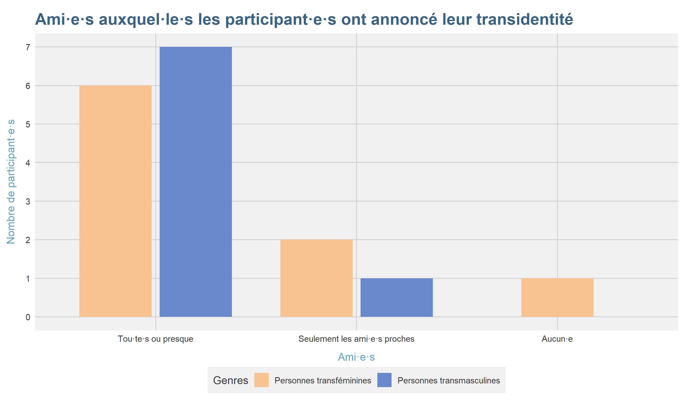

# Résultats

```{r import_data, message=FALSE, warning=FALSE, include=FALSE}

source('scripts/import_data.R')
requireNamespace('scales')
```

## Participant·e·s

### Éligibilité

Parmi les 71 patient·e·s que j'ai déjà vu·e·s au moins une fois en consultation dans le but d'initier ou de suivre un THAG, 24 avaient déjà un traitement en place, instauré par une autre personne que moi. À noter que 3 patient·e·s avaient commencé leur traitement sans supervision médicale, que ce soit en les achetant ailleurs qu'en pharmacie ou en les partageant avec des personnes prenant déjà un THAG. En outre, 10 patient·e·s n'avaient pas encore entamé leur THAG au moment où s'est achevée l'étape de sélection des participant·e·s. Enfin, 10 patient·e·s avaient entamé un THAG mais n'avaient pas encore bénéficié d'une prise de sang de contrôle à 3 mois et n'avaient donc qu'un unique point de données. 26 des 27 patient·e·s éligibles ont répondu positivement pour que leurs données soient utilisées dans le cadre de ce TFE. La figure \@ref(fig:flowchart) donne une représentation graphique de ce processus de sélection.

```{r flowchart, fig.align='center', fig.cap= 'Diagramme de flux présentant la sélection des patient·e·s pour le TFE', echo=FALSE, out.width = '800px'}

knitr::include_graphics('files/sample_flowchart.png', dpi = 72)
```

### Caractéristiques démographiques

L'âge des participant·e·s variait entre `r min(obj_demog_data$age)` et `r max(obj_demog_data$age)` ans (âge médian : `r round(median(obj_demog_data$age))` ans). L'échantillon se composait de `r sum(obj_demog_data$genre == "F")` femmes transgenres, `r sum(obj_demog_data$genre == "M")` hommes transgenres, `r sum(obj_demog_data$genre == "NB" & obj_demog_data$sexe == 'F')` personnes non-binaires transmasculines, et `r sum(obj_demog_data$genre == "NB" & obj_demog_data$sexe == 'M')` personne non-binaire transféminine. `r scales::percent(sum(obj_demog_data$province == 'Liege')/nrow(obj_demog_data))` des participant·e·s vivaient dans la Province de Liège. Au niveau du statut mutuelle, `r sum(obj_demog_data$mutuelle == 'BIM')` participant·e·s étaient BIM (soit `r scales::percent(sum(obj_demog_data$mutuelle == 'BIM')/nrow(obj_demog_data))` ) et `r sum(obj_demog_data$mutuelle == "Non-inscrit")` n'étaient pas en ordre de mutuelle. Enfin, au niveau administratif, `r scales::percent((sum(obj_demog_data$adm_pren == '1')+sum(obj_demog_data$adm_pren == '2'))/nrow(obj_demog_data))` des participant·e·s avaient modifié leur prénom à l'état-civil et `r scales::percent((sum(obj_demog_data$adm_cec == '1')+sum(obj_demog_data$adm_cec == '2'))/nrow(obj_demog_data))` avaient modifié leur marqueur de genre. Toutes ces caractéristiques démographiques sont résumées dans le tableau \@ref(tab:DemogTab).

```{r demog_table, include=FALSE}

source('scripts/tables/demog_table.R', encoding = 'UTF-8')
```

```{r demog_table_html, echo=FALSE, warning=FALSE, message=FALSE, tab.id = "DemogTab", out.width = '100%', eval = knitr::is_html_output()}

.demog_ft
```

```{r demog_table_word, echo=FALSE, warning=FALSE, message=FALSE, tab.id = "DemogTab", eval = !knitr::is_html_output()}
.demog_ft_word
```

Pour le reste des résultats de ce TFE, les hommes transgenres et personnes non-binaires transmasculines ont été fusionnées dans la catégorie "personnes transmasculines" tandis que les femmes transgenres et les personnes non-binaires transféminines ont été réunies dans la catégories "personnes transféminines" afin d'obtenir suffisamment de cas dans chaque case.

### Problèmes de santé

```{r ant_data_manipulation, include=FALSE}
source('scripts/data_manipulation/ant_data_manipulation.R', encoding = 'UTF-8')
```

Les problèmes de santé les plus représentés dans l'échantillon étaient des problèmes de santé mentale, avec `r .N_dep` patient·e·s présentant un trouble dépressif majeur (soit `r .p_dep` de l'échantillon), `r .N_anx` patient présentant un trouble anxieux et `r .N_alc` patient·e présentant un mésusage d'alcool. Les autres problèmes de santé retrouvés dans l'échantillon n'étaient présents qu'une fois : anémie ferriprive, asthme, BPCO, eczéma, syndrome de Fanconi, syndrome des ovaires micropolykystiques, rhinite chronique, et thrombophilie. En outre, `r .N_TSA_F` patientes se situaient sur le spectre autistique.

### Durée du suivi

```{r followup, include = FALSE}
source('scripts/data_manipulation/create_long_data.R', encoding = 'UTF-8')
source('scripts/plots/create_follow_up_plot.R', encoding = 'UTF-8')
```

Les participants·e·s de l'étude ont été suivis entre `r min(.followup_time$followup)` et `r max(.followup_time$followup)` jours avec une durée médiane de `r round(median(.followup_time$followup))` jours. `r sum(.followup$N[.followup$time_classe == '3 mois'])` patient·e·s ont été suivi·e·s durant trois mois, `r sum(.followup$N[.followup$time_classe == '6 mois'])` patient·e·s, durant six mois `r sum(.followup$N[.followup$time_classe == '9 mois'])`, durant neuf mois, et `r sum(.followup$N[.followup$time_classe == '12 mois'])`, durant douze mois ou plus. Un·e seul·e patient·e a été perdu·e de vue, suite à sa décision d'interrompre le THAG. La figure \@ref(fig:FollowPlot) représente la durée du suivi, par genres.

```{r FollowPlot, echo=FALSE, warning=FALSE, message=FALSE, fig.align='center', fig.cap="Durée du suivi, par genres", fig.dim=c(10,8), out.width = '100%', eval = knitr::is_html_output()}

.anim_followup_plot
```

```{r followup_plot_word, echo=FALSE, warning=FALSE, message=FALSE, fig.id = "FollowPlot", fig.cap="Nombre de patient·e·s par consultation trimestrielle et par genre", fig.width=6.7, fig.height=4, eval = !knitr::is_html_output()}

knitr::include_graphics('output/plots/followup_plot.png')
```

## Données subjectives

### Contexte social

```{r fam_plot, include=FALSE}
source('scripts/plots/create_fam_plot.R', encoding = 'UTF-8')
source('scripts/plots/create_amis_plot.R', encoding = 'UTF-8')
```

Une des questions que je pose à l'anamnèse de la première consultation est de savoir si un *coming out* a été fait et, si oui, auprès de quelles personnes et avec quelles réactions. L'objectif de cette question est d'évaluer le degré de soutien social dans le processus de transition. La figure \@ref(fig:FamPlot) montre une représentation graphique du coming out familial des patient·e·s de l'échantillon. Les patient·s· transmasculin·e·s de l'échantillon avaient tous au moins fait leur coming out à leurs deux parents tandis que `r .N_transfem_conceal` patient·e·s transféminines sur `r .N_transfem` n'avaient fait leur coming out qu'à une partie de leur famille, voire à personne pour l'une d'entre elles. A noter que l'information étaient absente du dossier pour `r sum(is.na(subj_soc_data$fam_pers))` patient·e·s transmasculin·e·s.

Parmi les patient·e·s ayant fait un coming out à leur famille, `r .p_reac_diff` ont vécu quelques difficultés dans les relations familiales par la suite dont `r .p_reac_neg` qui ont dû faire face à une réaction négative voire hostile.

```{r FamPlot, echo=FALSE, warning=FALSE, message=FALSE, fig.align='center', fig.cap="Membres de la famille auxquel·le·s les participant·e·s ont annoncé leur transidentité, par genre", fig.dim=c(10,8), out.width = '100%', eval = knitr::is_html_output()}

.anim_fam_plot
```

```{r fam_plot_word, echo=FALSE, warning=FALSE, message=FALSE, fig.id = "FamPlot", fig.cap="Membres de la famille auxquel·le·s les participant·e·s ont annoncé leur transidentité, par genre", fig.width=6.7, fig.height=4, eval = !knitr::is_html_output()}

knitr::include_graphics('output/plots/fam_plot.png')
```

Au niveau amical, la figure \@ref(fig:AmisPlot) montre un pattern similaire à ce qui a été décrit pour le *coming out* familial avec une moins grande tendance des personnes transféminines à révéler leur transidentité à leurs proches. Ces résultats doivent toutefois être interprétés prudemment dans la mesure où il manque des données pour 9 participant·e·s (5 personnes transféminines et 4 transmasculines). Toutefois, puisque les valeurs manquantes ne touchaient pas disproportionnent un groupe et que les résultats étaient cohérents avec ceux de la figure \@ref(fig:FamPlot), j'ai choisi de présenter ce graphique. En ce qui concerne la réaction des ami·e·s, celle-ci a été positive pour la totalité de l'échantillon.

```{r AmisPlot, echo=FALSE, warning=FALSE, message=FALSE, fig.align='center', fig.cap="Ami·e·s auxquel·le·s les participant·e·s ont annoncé leur transidentité, par genre", fig.dim=c(10,8), out.width = '100%', eval = knitr::is_html_output()}

.anim_amis_plot
```

```{r amis_plot_word, echo=FALSE, warning=FALSE, message=FALSE, fig.id = "AmisPlot", fig.cap="Ami·e·s auxquel·le·s les participant·e·s ont annoncé leur transidentité, par genre", fig.width=6.7, fig.height=4, eval = !knitr::is_html_output()}


```

### Attentes vis-à-vis du THAG

```{r subj_horm_data, include= FALSE}
source('scripts/data_manipulation/manipulate_subj_horm_data.R', encoding = 'UTF-8')
```

Afin de mieux cerner les attentes des patient·e·s et de leur proposer un traitement le plus adapté à ces dernières, je leur demande ensuite s'iels connaissent les effets du THAG et, si oui, s'iels identifient des effets particulièrement importants pour leur point de confort actuel.

Pour les personnes transféminines, les effets les plus souvent mentionnés comme prioritaires étaient : une majoration de la poitrine (`r .p_prio_poit` des patientes), une répartition plus féminine des graisses (`r .p_prio_gras_F`), une diminution de la pilosité (`r .p_prio_pilo_F`), et un arrêt de la progression de l'alopécie androgénique (`r .p_prio_alo`). Un·e patient·e avait mentionné l'adoucissement de la peau tandis qu'aucun·e patient·e n'avait explicitement évoqué la diminution des érections spontanées ou la diminution de la masse musculaire comme étant une priorité.

Pour les personnes transmasculines, l'aggravation de la voix était l'effet le plus souvent recherché. Il s'agissait d'une priorité pour `r .p_prio_voix` des patient·e·s. Une répartition plus masculine des graisses et une majoration de la musculature étaient une priorité pour `r .p_prio_gras_M` des patient·e·s. `r .p_prio_pilo_M` des patient·e·s considéraient la majoration de leur pilosité comme une priorité tandis qu'un·e des patient·e·s avait mentionné l'accroissement du dickclit. Aucun·e n'avait cité l'aménorrhée comme étant sa priorité à l'initiation du THAG.

Au niveau des inquiétudes vis-à-vis de l'instauration du THAG, deux patient·e·s ont mentionné l'alopécie, un·e patient·e a évoqué l'acné, et un·e patient·e avait peur d'avoir une humeur plus instable à l'instauration du traitement.

Vu les impacts du THAG sur la fertilité mentionnés dans l'introduction, je demande aux patient·e·s s'iels sont intéressé·e·s par la cryopréservation de leurs gamètes avant d'instaurer le THAG. Aucun patient transmasculin de l'échantillon n'a choisi de congeler ses gamètes avant THAG tandis que `r sum(subj_horm_data$cryo == '1')` patientes transféminines ont préféré entamer les démarches de cryopréservation avant de commencer le THAG.

### Besoins chirurgicaux

```{r chir_data, include=FALSE}
source('scripts/data_manipulation/manipulate_subj_chir_data.R', encoding = 'UTF-8')
```

Toujours dans l'optique d'appréhender au mieux le point de confort des patient·e·s, l'anamnèse de la première consultation recouvre aussi des questions inhérentes aux besoins en termes d'intervention chirurgicale.

Pour les patientes transféminines, la chirurgie la plus souvent identifiée comme nécessaire était la vaginoplastie (`r .p_vag2` des patient·e·s), suivie par les FFS (`r .p_ffs2`). Une patiente avait mentionné l'augmentation mammaire et aucun·e n'avait considéré les chirurgies vocales. En plus des patient·e·s ayant déjà une idée précise des chirurgies qui leur semblent nécessaires, `r .N_ffs1` patient·e·s hésitaient sur la FFS et une, sur la vaginoplastie. Dans l'ensemble, en ne comptant pas les patient·e·s qui hésitaient, `r .N_chir0` patient·e·s n'envisageaient aucune chirurgie, `r .N_chir1` patient·e·s en envisageaient une et `r .N_chir2` en envisageait deux.

La torsoplastie était considérée comme nécessaire par `r .p_torso2` des patient·e·s transmasculin·e·s tandis que les `r .p_torso1` restant·e·s y réfléchissaient encore lors de la première consultation. L'hystérectomie était envisagée par `r .p_hystero` des patient·e·s. Aucun·e patient·e n'envisageait de chirurgie génitale. Dans l'ensemble, en ne prenant en compte que les patient·e·s qui étaient sûrs de leur choix, `r .N_chir0M` patients n'envisageaient aucune chirurgie, `r .N_chir1M` en envisageaient une, et `r .N_chir2M` en envisageaient deux.

A la rédaction de ce TFE, aucune patiente transféminine n'avait réalisé de chirurgie. Dans le même temps, `r sum(obj_chir_data$real_torso == '2', na.rm = T)` patient·e·s transmasculin·e·s ont bénéficié d'une torsoplastie après l'initiation du THAG tandis que `r sum(obj_chir_data$real_torso == '3', na.rm = T)` patient·e·s avaient réalisé leur torsoplastie avant la première consultation. Enfin, `r sum(obj_chir_data$real_hystero == '2', na.rm = T)` patient·e a réalisé une hystérectomie afin de se rapprocher de son point de confort.

## Données objectives

### Paramètres
